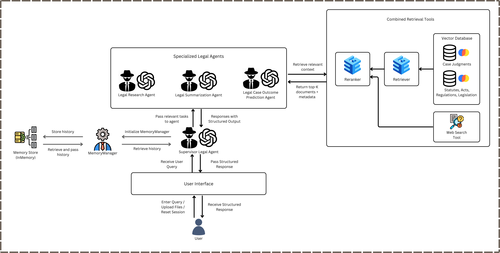

# Malaysian Civil Cases Legal Assistant - Final Year Project (FYP)

A sophisticated multi-agent legal AI system specializing in Malaysian Civil Law, featuring intelligent routing, document processing, and comprehensive evaluation capabilities.

## 🌟 Key Features

### Multi-Agent Architecture
- **🎯 Supervisor Agent**: Intelligent routing system that delegates queries to specialized agents
- **🔬 Legal Research Agent**: Expert in Malaysian Civil Law research and case law analysis
- **📄 Summarization Agent**: Specialized in legal document summarization and key point extraction
- **⚖️ Case Prediction Agent**: Analyzes legal scenarios and predicts potential outcomes

### Professional Web Interface
- **💬 Modern Chat Interface**: Clean, responsive Gradio-based interface
- **📎 File Upload Support**: Process PDF, DOCX, TXT files and images with OCR
- **🔄 Real-time Streaming**: See agent processing in real-time
- **📚 Session Management**: Persistent conversation history per user
- **⚙️ Model Selection**: Support for multiple AI models (OpenAI, Anthropic)

### Advanced Capabilities
- **🇲🇾 Malaysian Civil Law Specialization**: Focused expertise in Malaysian legal system
- **🏛️ Vector Database Integration**: ChromaDB with LlamaIndex for document retrieval
- **📊 Comprehensive Evaluation**: LLM-as-a-judge evaluation system with multiple metrics
- **🛡️ Security Guardrails**: Built-in safeguards and legal disclaimers

## 🏗️ System Architecture



## 🚀 Quick Start

### Prerequisites
- Python 3.10 or higher
- OpenAI API key (required)
- Anthropic API key (optional)

### Installation

1. **Clone the Repository**:
   ```bash
   git clone <repository-url>
   cd llm-legal-assistant
   ```

2. **Install Dependencies**:
   ```bash
   pip install -r requirements.txt
   ```

3. **Set Environment Variables**:
   Create a `.env` file in the project root:
   ```env
   OPENAI_API_KEY=your_openai_api_key_here
   ANTHROPIC_API_KEY=your_anthropic_api_key_here  # Optional
   ```

4. **Launch the Web Interface**:
   ```bash
   python launch.py
   ```

5. **Access the Interface**:
   Open your browser and navigate to: `http://127.0.0.1:7860`

## 📖 Usage Guide

### Basic Legal Queries
Ask questions about Malaysian Civil Law:
```
"What are the requirements for a valid contract under Malaysian law?"
"How do Malaysian courts determine negligence in tort cases?"
"What remedies are available for breach of contract?"
```

### Document Analysis
Upload legal documents (PDF, DOCX) for:
- Summarization and key point extraction
- Legal analysis and interpretation
- Case law identification and comparison

### Case Scenario Analysis
Provide case scenarios for:
- Outcome prediction
- Legal risk assessment
- Strategic legal analysis

### Advanced Features
- **Multi-turn Conversations**: Maintain context across questions
- **Session History**: Previous conversations are remembered
- **File Processing**: Upload and analyze legal documents
- **Real-time Streaming**: Watch the AI process your queries

## 🔧 Configuration

### Model Selection
The system supports multiple AI models:
- `openai:gpt-4.1` (recommended)
- `openai:gpt-4.1-mini` (faster, cost-effective)
- `anthropic:claude-3-sonnet`
- `anthropic:claude-3-haiku`

### Customization
- Modify prompts in `app/api/src/prompt_templates/`
- Adjust agent behavior in `app/api/src/agents/routing.py`
- Configure evaluation metrics in `app/api/src/evaluation/`

## 📊 Evaluation System

The project includes a comprehensive evaluation framework:

### Evaluation Capabilities
- **Legal Summarization**: ROUGE/BLEU scores and LLM-as-Judge assessment
- **Legal Research**: Precision/Recall metrics for information retrieval
- **Case Prediction**: Classification accuracy and regression metrics
- **System Performance**: Latency and throughput analysis

### Running Evaluations
```bash
cd app/api/src/evaluation
python evaluation.py
```

### Test Suite
```bash
cd tests/evaluation
python -m pytest test_evaluation_simple.py -v
```

## 🏛️ Legal Specialization

### Malaysian Civil Law Focus
- **Contract Law**: Formation, breach, remedies
- **Tort Law**: Negligence, defamation, damages
- **Property Law**: Land titles, ownership disputes
- **Company Law**: Corporate governance, liability
- **Family Law**: Divorce, custody, matrimonial property
- **Civil Procedure**: Court processes, evidence rules

### Legal Safeguards
- Built-in disclaimers for all responses
- Clear limitations on legal advice
- Malaysian jurisdiction specificity
- Ethical AI guidelines compliance

## 📁 Project Structure

```
llm-legal-assistant/
├── app/
│   ├── api/
│   │   └── src/
│   │       ├── agents/              # Multi-agent system (LangGraph routing)
│   │       │   ├── routing.py       # Core LangGraph implementation
│   │       │   └── __init__.py
│   │       ├── evaluation/          # Evaluation framework (LLM-as-a-judge)
│   │       │   ├── evaluation.py
│   │       │   └── README.md
│   │       ├── llm/                 # LLM initialization/adapters
│   │       ├── memory/              # Memory/session utilities
│   │       ├── preprocessing/       # Data/document preprocessing
│   │       ├── prompt_templates/    # Agent/system prompts
│   │       ├── storage/             # DB and vector store configs
│   │       │   └── db_config.py
│   │       ├── tools/               # External tools (web/vector search, etc.)
│   │       └── utils/               # Helpers and shared utilities
│   └── web/
│       ├── gradio_interface.py      # Main web interface
│       └── README.md
├── data/
│   ├── processed/                   # Processed legal datasets (gitignored contents)
│   └── raw/                         # Raw legal docs (gitignored contents)
├── tests/                           # Unit/integration tests
│   ├── agents/
│   ├── db_config/
│   ├── evaluation/
│   ├── llm/
│   ├── memory/
│   ├── tools_manager/
│   └── vector_search/
├── README.md
├── launch.py                        # Local launcher (port 7860)
└── requirements.txt                 # Single consolidated dependency list
```

## 🧪 Development & Testing

### Running Tests
```bash
# All tests
python -m pytest tests/ -v

# Specific test suite
python -m pytest tests/evaluation/ -v

# Agent system tests
python -m pytest tests/agents/ -v
```

### Development Mode
```bash
cd app/web
python launch.py  # Runs with debug mode enabled
```

### Adding New Agents
1. Define agent prompts in `prompt_templates/`
2. Implement agent logic in `agents/routing.py`
3. Update the supervisor routing logic
4. Add corresponding tests

## 🔍 Troubleshooting

### Common Issues
1. **API Key Errors**: Ensure environment variables are set correctly
2. **Import Errors**: Check Python path and dependencies
3. **Model Errors**: Verify API keys and model availability
4. **Interface Issues**: Check port availability (7860)

### Debug Mode
Enable detailed logging:
```python
import logging
logging.basicConfig(level=logging.DEBUG)
```

### Performance Optimization
- Use `gpt-4o-mini` for faster responses
- Implement caching for repeated queries
- Optimize vector database indexing

## 📝 Legal Disclaimer

**⚠️ IMPORTANT LEGAL NOTICE**

This system is designed for **educational and research purposes only**. It:

- **DOES NOT** provide legal advice
- **DOES NOT** replace qualified legal professionals
- **DOES NOT** guarantee accuracy of legal information
- **SHOULD NOT** be used for actual legal decision-making

**Always consult qualified Malaysian legal professionals for any specific legal matters.**

## 🤝 Contributing

### Development Guidelines
1. Follow existing code structure and naming conventions
2. Add comprehensive tests for new features
3. Update documentation for any changes
4. Ensure legal disclaimers are maintained

### Areas for Contribution
- Additional Malaysian legal domains
- Enhanced evaluation metrics
- User interface improvements
- Performance optimizations
- Documentation enhancements

## 📄 Dependencies

### Core Dependencies
- **LangChain/LangGraph**: Multi-agent orchestration
- **Gradio**: Web interface framework
- **ChromaDB**: Vector database for document retrieval
- **OpenAI/Anthropic**: LLM providers
- **PyMuPDF**: PDF processing
- **python-docx**: DOCX document handling

### Evaluation Dependencies
- **Pytest**: Testing framework
- **ROUGE**: Text summarization metrics
- **AsyncIO**: Asynchronous operation support

See `requirements.txt` for complete dependency list.

## 📊 System Specifications

### Performance Metrics
- **Response Time**: 2-10 seconds per query
- **Concurrent Users**: Supports multiple sessions
- **File Processing**: PDF, DOCX, TXT, images
- **Model Support**: OpenAI GPT-4, Claude-3 variants

### Scalability
- Stateless agent design for horizontal scaling
- Session management for user persistence
- Configurable model backends
- Modular architecture for easy extension

## 🔮 Future Enhancements

### Planned Features
- **Multi-language Support**: Bahasa Malaysia integration
- **Document Templates**: Legal document generation
- **Case Database**: Expanded Malaysian case law coverage
- **API Endpoints**: REST API for third-party integration
- **Mobile App**: Native mobile application

### Research Areas
- **Fine-tuned Models**: Malaysian legal domain adaptation
- **Advanced RAG**: Improved retrieval techniques
- **Legal Reasoning**: Enhanced logical inference
- **Compliance Monitoring**: Automated legal compliance checking

## 📞 Support

For questions, issues, or contributions:
1. Check existing documentation
2. Review troubleshooting guide
3. Search closed issues
4. Create detailed issue reports

---

**Built with ❤️ for the Malaysian Legal Community**

*Last Updated: September 2025*
